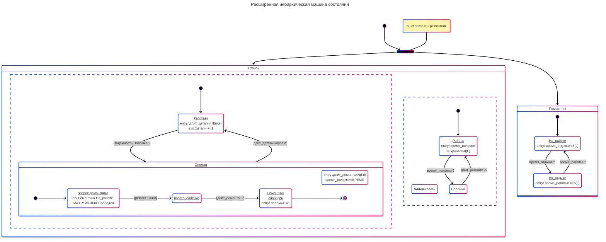
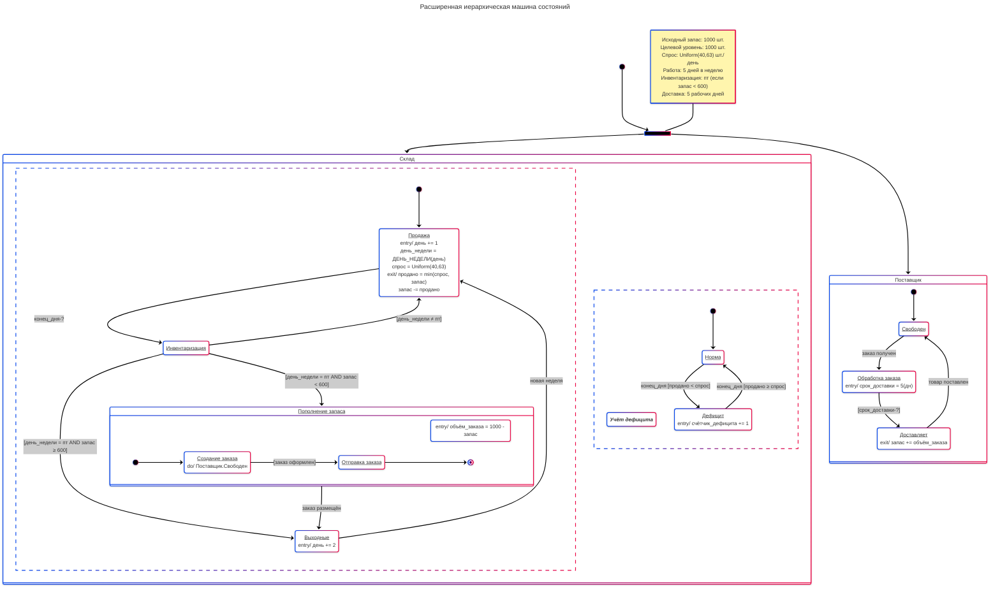

# Семинар 15

## Задание 1. Ремонт



Код диаграммы:

```text
--- 
title: Расширенная иерархическая машина состояний 
config: 
    theme: neo 
    look: neo 
---
stateDiagram-v2 
    direction TB 
    state maintain <<fork>> 
    [*] --> maintain 
    maintain --> Станок 
    maintain --> Ремонтник 

    note left of maintain 
        50 станков и 1 ремонтник 
    end note 

    state Станок { 
        working:<u>Работает</u><br>entry/ длит_детали=N(m,s)<br>exit /детали +=1 
        failed: <u>Сломан</u> 
        [*] --> working 
        working --> failed :Надежность.Поломка-? 
        failed --> working :длит_детали коррект. 
        -- 
        accTitle: <em><b>Надежность</b></em> 
        work: <u>Работа</u><br>entry/ время_поломки<br>=Exponential(L) 
        [*] --> work 
        work --> Поломка : время_поломки ? 
        Поломка --> work : длит_ремонта -? 
    }

    state Ремонтник { 
        startwork : <u>На_работе</u><br>entry/ время_отдыха+=8(ч) 
        endwork : <u>На_отдыхе</u><br>entry/ время_работы+=16(ч) 
        [*] --> startwork 
        startwork --> endwork :время_отдыха-? 
        endwork --> startwork :время_работы-? 
    }
    
    state failed { 
        ent: entry /длит_ремонта=N(f,d)<br>время_поломки=ВРЕМЯ 
        request_fixer: <u>запрос ремонтника</u><br>do/ Ремонтник.На_работе AND Ремонтник.Свободен 
        wait_repair: <u>восстановление</u> 
        release_fixer: <u>Ремонтник<br>свободен</u><br> entry/ поломка+=1 
        direction LR 
        [*] --> request_fixer 
        request_fixer --> wait_repair :[ремонт начат] 
        wait_repair --> release_fixer:[длит_ремонта -?] 
        release_fixer --> [*] 
    }
```

## Задание 2. Складское обслуживание



Код диаграммы:

```text
---
title: Расширенная иерархическая машина состояний
config:
  theme: neo
  look: neo
---
stateDiagram-v2
    direction TB
    state init <<fork>>
    [*] --> init
    init --> Склад
    init --> Поставщик

    note left of init
        Исходный запас: 1000 шт.
        Целевой уровень: 1000 шт.
        Спрос: Uniform(40,63) шт./день
        Работа: 5 дней в неделю
        Инвентаризация: пт (если запас < 600)
        Доставка: 5 рабочих дней
    end note

    state Склад {
        selling: <u>Продажа</u><br>entry/ день += 1<br>день_недели = ДЕНЬ_НЕДЕЛИ(день)<br>спрос = Uniform(40,63)<br>exit/ продано = min(спрос, запас)<br>запас -= продано
        check: <u>Инвентаризация</u>
        reorder: <u>Пополнение запаса</u>
        weekend: <u>Выходные</u><br>entry/ день += 2
        [*] --> selling
        selling --> check : конец_дня-?
        check --> selling : [день_недели ≠ пт]
        check --> reorder : [день_недели = пт AND запас < 600]
        check --> weekend : [день_недели = пт AND запас ≥ 600]
        reorder --> weekend : заказ размещён
        weekend --> selling : новая неделя
        --
        accTitle: <em><b>Учёт дефицита</b></em>
        norma: <u>Норма</u>
        deficit: <u>Дефицит</u><br>entry/ счётчик_дефицита += 1
        [*] --> norma
        norma --> deficit : конец_дня [продано < спрос]
        deficit --> norma : конец_дня [продано ≥ спрос]
    }

    state reorder {
        ent2: entry/ объём_заказа = 1000 - запас
        place_order: <u>Создание заказа</u><br>do/ Поставщик.Свободен
        send_order: <u>Отправка заказа</u>
        direction LR
        [*] --> place_order
        place_order --> send_order : [заказ оформлен]
        send_order --> [*]
    }

    state Поставщик {
        free: <u>Свободен</u>
        processing: <u>Обработка заказа</u><br>entry/ срок_доставки = 5(дн)
        delivery: <u>Доставляет</u><br>exit/ запас += объём_заказа
        [*] --> free
        free --> processing : заказ получен
        processing --> delivery : [срок_доставки-?]
        delivery --> free : товар поставлен
    }
```
